# Laporan Proyek Memprediksi Performa Siswa - Akhmad Ardiansyah Amnur

## Domain Proyek

Peningkatan kualitas pendidikan menjadi fokus utama dalam pengembangan sumber daya manusia. Salah satu aspek penting dalam pendidikan adalah evaluasi dan prediksi performa siswa. Dengan kemampuan untuk memprediksi performa siswa, institusi pendidikan dapat mengambil langkah-langkah preventif dan intervensi yang tepat untuk meningkatkan hasil belajar siswa.

Refrensi:
- [Data Sains untk Prediksi Kinerja Siswa](https://republika.co.id/berita//s9xi5i181996644825001/data-sains-untk-prediksi-kinerja-siswa)

## Business Understanding

Sistem pendidikan modern menghadapi tantangan dalam mengidentifikasi siswa yang berisiko mengalami penurunan performa akademik secara dini. Kegagalan mendeteksi masalah ini dapat menyebabkan tingginya angka ketidaklulusan, penurunan motivasi belajar, atau bahkan putus sekolah. Proyek ini bertujuan membangun model prediktif berbasis data untuk memprediksi performa siswa (misalnya: kategori nilai, risiko gagal, atau kelulusan) berdasarkan faktor-faktor seperti kehadiran, jam belajar, dan latar belakang sosial-ekonomi. Hasil prediksi ini akan membantu institusi pendidikan merancang intervensi yang tepat sasaran, seperti program bimbingan tambahan atau pendampingan psikologis.

### Problem statements

1. Bagaimana cara meningkatkan kualitas pembelajaran di institusi pendidikan?
2. Bagaimana cara mengoptimalkan alokasi sumber daya pendidikan untuk mendukung performa siswa?
3. Bagaimana cara mengidentifikasi siswa yang berisiko mengalami kesulitan belajar sejak dini?

### Goals

1. Mengembangkan model prediksi yang akurat untuk memahami faktor-faktor yang mempengaruhi performa siswa, sehingga institusi pendidikan dapat menyesuaikan strategi pembelajaran yang lebih efektif.
2. Memungkinkan alokasi sumber daya pendidikan yang lebih efisien berdasarkan kebutuhan siswa yang teridentifikasi melalui model prediksi, memastikan bahwa sumber daya dialokasikan di mana mereka paling dibutuhkan.
3. Membangun sistem identifikasi dini berbasis data yang dapat mengidentifikasi siswa yang berpotensi mengalami kesulitan belajar, memungkinkan intervensi preventif yang lebih awal.

### Solution Statement

1. Mengembangkan model baseline Regresi Linear Berganda untuk memprediksi performa siswa berdasarkan data jam belajar, kehadiran, dan sosial ekonomi. Model ini akan memberikan dasar untuk perbandingan dengan model-model yang lebih kompleks.
2. Mengembangkan model baseline dengan algoritma Random Forest. Algoritma ini akan menggabungkan kekuatan beberapa pohon keputusan untuk meningkatkan akurasi prediksi dan mengurangi risiko overfitting.
3. Mengembangkan model K-Nearest Neighbors (KNN) untuk memprediksi performa siswa berdasarkan kedekatan fitur dengan data tetangga terdekat.
4. Mengembangkan model AdaBoost Regressor untuk meningkatkan akurasi prediksi dengan memberikan bobot yang lebih besar pada data yang sulit diprediksi.
5. Setiap solusi di atas akan dievaluasi menggunakan metrik evaluasi yang sesuai, seperti Mean Squared Error (MSE). Metrik ini akan membantu mengukur kinerja setiap model dan membandingkannya satu sama lain.

## Data Understanding

**[Dataset Predict Student Performance](https://www.kaggle.com/datasets/stealthtechnologies/predict-student-performance-dataset)** yang digunakan dalam proyek ini adalah representasi buatan (sintetis) dari data performa siswa.  Tujuannya adalah untuk mensimulasikan kondisi-kondisi riil yang mempengaruhi prestasi siswa. 

Data ini mencakup berbagai faktor yang diduga berperan penting, antara lain:

1. **Study Hours**: Pola dan durasi belajar siswa.
2. **Sleep Hours**: Kualitas dan kuantitas tidur siswa.
3. **Socioeconomic Score**: Kondisi ekonomi dan sosial keluarga siswa.
4. **Attendance(%)**: Tingkat kehadiran siswa dalam kegiatan pembelajaran.
5. **Grades (TARGET)**: Skor performa akhir siswa, diperoleh dari kombinasi study hours, sleep hours, soctoeconomic score, dan attendance.

- **Jumlah Data**:
    - Jumlah row pada dataset sebanyak 1388 rows
    - Jumlah kolom(variabel) pada dataset sebanyak 5 kolom
     

    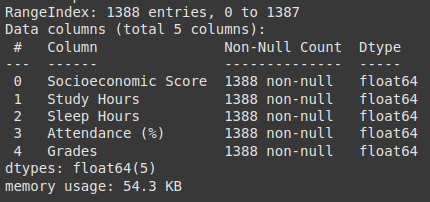

- **Kondisi Data**:
    - Semua tipe data pada variabel berupa numerik
     

    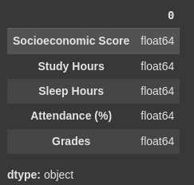

    - Tidak ada missing value
     

    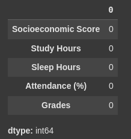

    - Terdapat beberapa outlier pada variabel **Study Hours**, **Attendence(%)**, dan **Grades**:
     

    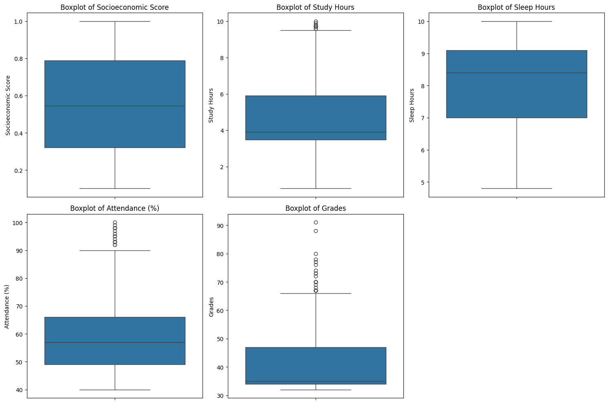

    - Tidak terdapat duplikasi data
     

    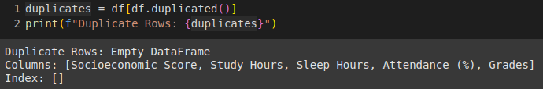

- **Exploratory Data Analysis(EDA)**

    - **Univariate Analysis**:
         
         
        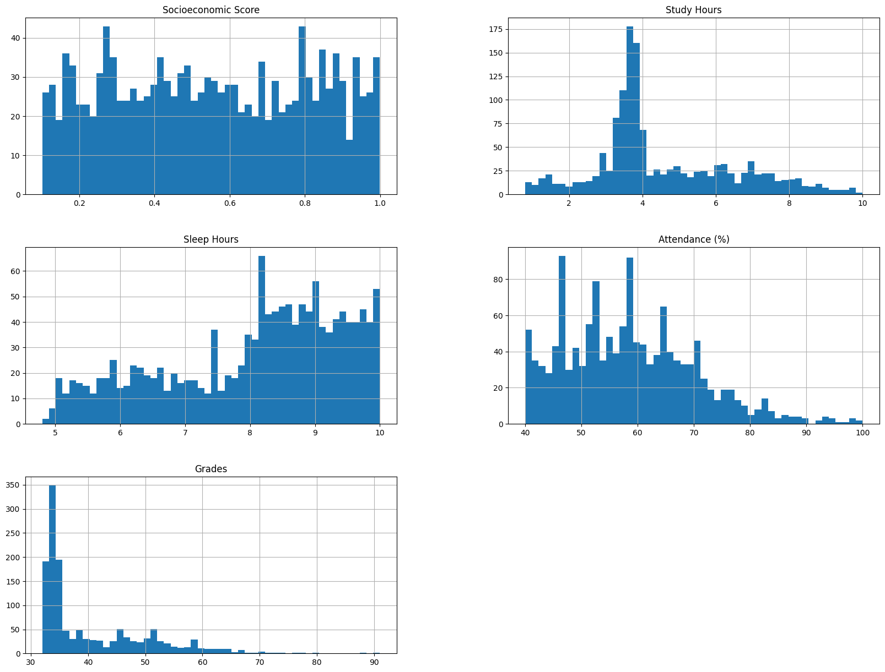

        - **Socioeconomic Score**: Sebagian besar siswa memiliki skor sosioekonomi yang terdistribusi merata di sekitar nilai tengah. Tidak ada kelompok yang sangat menonjol atau outlier yang signifikan.
        - **Study Hours**: Sebagian besar siswa menghabiskan waktu belajar sekitar 4-6 jam. Ada beberapa siswa yang belajar jauh lebih banyak (outlier pada ujung kanan).
        - **Sleep Hours**: Sebagian besar siswa tidur sekitar 7-8 jam. Distribusi cenderung normal.
        - **Attandance(%)**: Sebagian besar siswa memiliki persentase kehadiran yang tinggi (di atas 70%). Ada beberapa siswa dengan persentase kehadiran yang rendah (outlier).
        - **Grades**: Sebagian besar siswa memiliki nilai berkisar antara 50-70. Ada beberapa siswa dengan nilai yang sangat tinggi dan beberapa dengan nilai yang sangat rendah.

    - **Multivariate Analysis**:

  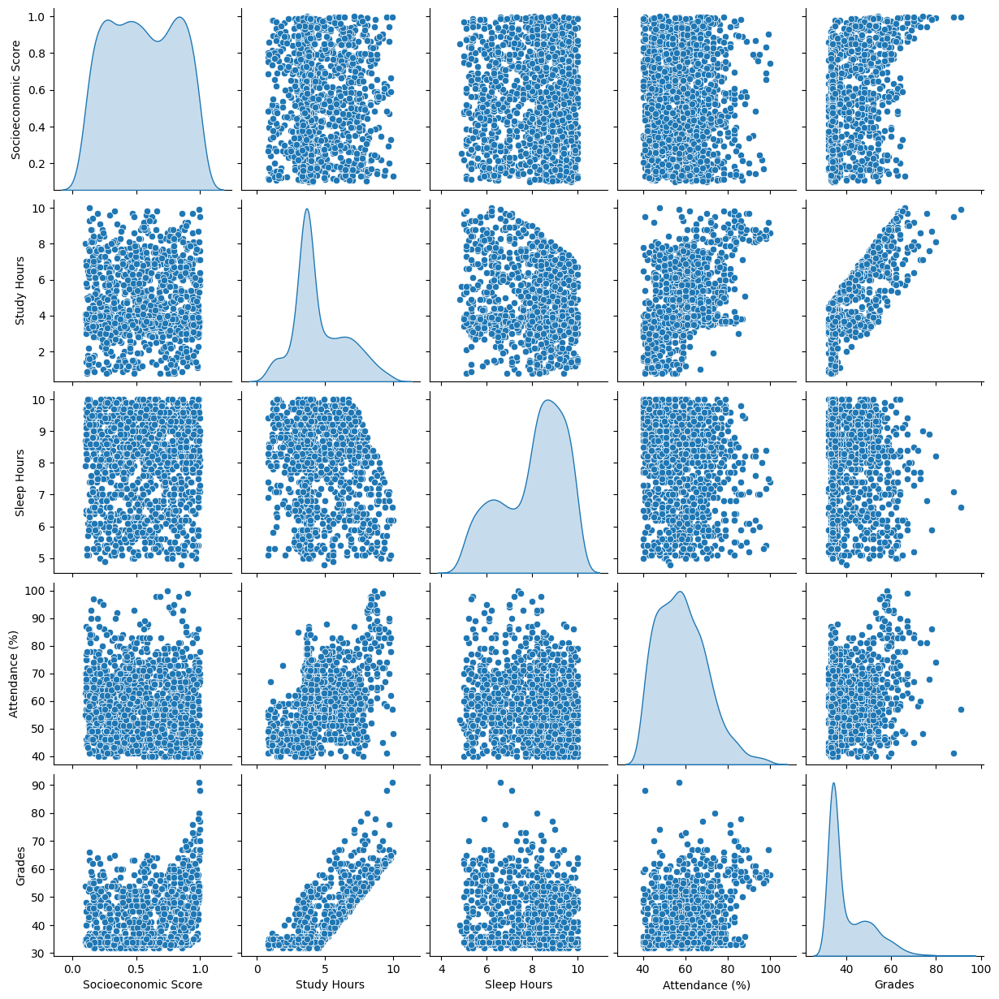
  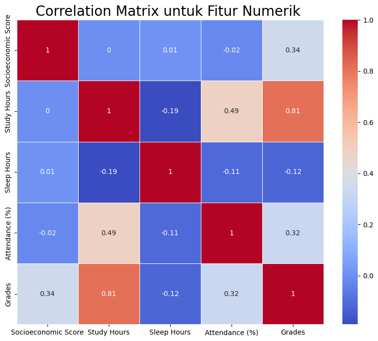

Dari visualisasi ini, kita dapat mengamati beberapa hal berikut:

- Korelasi Positif:
    - **Study Hours** dan **Grades**: Semakin banyak siswa belajar, cenderung semakin tinggi nilai yang diperoleh. Ini menunjukkan hubungan positif yang kuat.
    - **Attendance(%)** dan **Grades**: Semakin tinggi persentase kehadiran, cenderung semakin tinggi nilai yang diperoleh. Ini juga menunjukkan hubungan positif yang kuat.
- Korelasi Negatif:
    - **Sleep Hours** dan **Grades**: Tampaknya tidak ada korelasi yang signifikan antara jam tidur dan nilai.

## Data Preparation

- **Delete Outliers**:
    Mengoptimalkan dataset dengan menghapus data ekstrem yang tidak konsisten dengan distribusi data mayoritas.

- **Remove Unnecessary Variables**:
    Menghapus variabel Sleep Hours karena memiliki korelasi yang sangat lemah dengan Grades.
     

    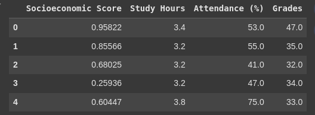

- **Train-Test-Split**
    Membagi dataset menjadi data latih (train) 90% dan data uji (test) 10% dengan menggunakan fungsi train_test_split dari scikit-learn.

- **Standarization**
    Melakukan standarisasi pada data latih (train) menggunakan kelas StandardScaler agar bisa diimplementasikan pada algoritma machine learning yang akan digunakan.

## Modeling

Model machine learning yang digunakan untuk menyelesaikan permasalahan prediksi performa siswa:

1. **Linear Regression**:
Model baseline yang digunakan untuk memahami hubungan linear antara fitur (variabel independen) dan target (nilai siswa).
- ***Kelebihan***: Sederhana, mudah diinterpretasikan, komputasi efisien.
- ***Kekurangan***: Hanya efektif jika hubungan antar variabel linear, kurang akurat jika terdapat hubungan non-linear.

2. **K-Nearest Neighbors (KNN)**:
Memprediksi nilai siswa berdasarkan nilai k tetangga terdekat dalam ruang fitur.
- ***Kelebihan***: Sederhana, mudah diimplementasikan, tidak ada asumsi tentang bentuk hubungan antar variabel.
- ***Kekurangan***: Perlu menentukan nilai k yang optimal, komputasi mahal untuk data yang besar.

3. **Random Forest**:
Membangun banyak pohon keputusan dan menggabungkan prediksinya.
- ***Kelebihan***: Akurat, robust terhadap outlier, dapat menangani hubungan non-linear.
- ***Kekurangan***: Lebih kompleks dari model linear, membutuhkan lebih banyak sumber daya komputasi.

4. **AdaBoost Regressor**:
Meningkatkan akurasi prediksi dengan memberikan bobot yang lebih besar pada data yang sulit diprediksi.
- ***Kelebihan***: Meningkatkan akurasi model weak learners, adaptif terhadap data.
- ***Kekurangan***: Rentan terhadap overfitting jika terlalu kompleks.

Dari algoritma machine learning yang sudah diimplementasikan, Random Forest merupakan algoritma yang bagus karena memiliki nilai error terendah berdasarkan Mean Squared Error.

## Evaluation
Mean Squared Error (MSE) merupakan Metrik evaluasi yang digunakan untuk mengukur kinerja model prediksi performa 

- LR: Linear Regression
- KNN: K-Nearest Neighbors
- RF: Random Forest
- Boosting: AdaBoost Regressor

**Report Mean Squared Error**
-------------------------------------------
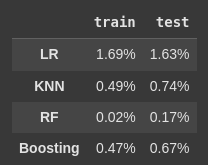

**Visualize report Mean Squared Error**
-------------------------------------------
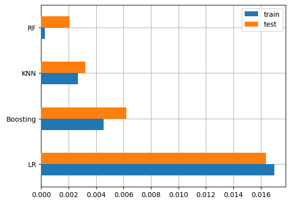

**Testing model with test data**
-------------------------------------------
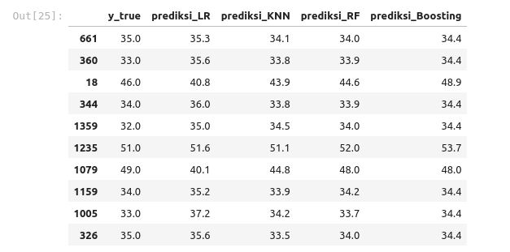
