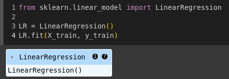
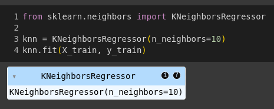
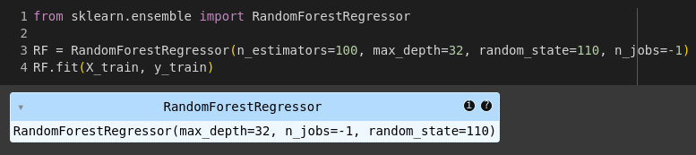
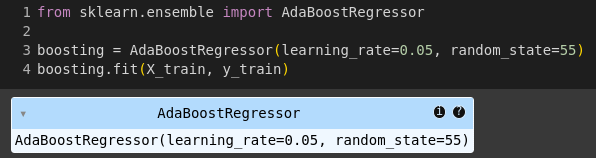
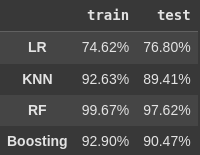

# Laporan Proyek Prediksi Performa Siswa - Akhmad Ardiansyah Amnur

## Domain Proyek

Peningkatan kualitas pendidikan menjadi fokus utama dalam pengembangan sumber daya manusia. Salah satu aspek penting dalam pendidikan adalah evaluasi dan prediksi performa siswa. Dengan kemampuan untuk memprediksi performa siswa, institusi pendidikan dapat mengambil langkah-langkah preventif dan intervensi yang tepat untuk meningkatkan hasil belajar siswa.

Refrensi:
- [Data Sains untk Prediksi Kinerja Siswa](https://republika.co.id/berita//s9xi5i181996644825001/data-sains-untk-prediksi-kinerja-siswa)

## Business Understanding

Sistem pendidikan modern menghadapi tantangan dalam mengidentifikasi siswa yang berisiko mengalami penurunan performa akademik secara dini. Kegagalan mendeteksi masalah ini dapat menyebabkan tingginya angka ketidaklulusan, penurunan motivasi belajar, atau bahkan putus sekolah. Proyek ini bertujuan membangun model prediktif berbasis data untuk memprediksi performa siswa (misalnya: kategori nilai, risiko gagal, atau kelulusan) berdasarkan faktor-faktor seperti kehadiran, jam belajar, dan latar belakang sosial-ekonomi. Hasil prediksi ini akan membantu institusi pendidikan merancang intervensi yang tepat sasaran, seperti program bimbingan tambahan atau pendampingan psikologis.

### Problem statements

1. Bagaimana cara meningkatkan kualitas pembelajaran di institusi pendidikan?
2. Bagaimana cara mengoptimalkan alokasi sumber daya pendidikan untuk mendukung performa siswa?
3. Bagaimana cara mengidentifikasi siswa yang berisiko mengalami kesulitan belajar sejak dini?

### Goals

1. Mengembangkan model prediksi yang akurat untuk memahami faktor-faktor yang mempengaruhi performa siswa, sehingga institusi pendidikan dapat menyesuaikan strategi pembelajaran yang lebih efektif.
2. Memungkinkan alokasi sumber daya pendidikan yang lebih efisien berdasarkan kebutuhan siswa yang teridentifikasi melalui model prediksi, memastikan bahwa sumber daya dialokasikan di mana mereka paling dibutuhkan.
3. Membangun sistem identifikasi dini berbasis data yang dapat mengidentifikasi siswa yang berpotensi mengalami kesulitan belajar, memungkinkan intervensi preventif yang lebih awal.

### Solution Statement

1. Mengembangkan model baseline Regresi Linear Berganda untuk memprediksi performa siswa berdasarkan data jam belajar, kehadiran, dan sosial ekonomi. Model ini akan memberikan dasar untuk perbandingan dengan model-model yang lebih kompleks.
2. Mengembangkan model baseline dengan algoritma Random Forest. Algoritma ini akan menggabungkan kekuatan beberapa pohon keputusan untuk meningkatkan akurasi prediksi dan mengurangi risiko overfitting.
3. Mengembangkan model K-Nearest Neighbors (KNN) untuk memprediksi performa siswa berdasarkan kedekatan fitur dengan data tetangga terdekat.
4. Mengembangkan model AdaBoost Regressor untuk meningkatkan akurasi prediksi dengan memberikan bobot yang lebih besar pada data yang sulit diprediksi.
5. Setiap solusi di atas akan dievaluasi menggunakan metrik evaluasi yang sesuai, seperti Mean Squared Error (MSE) dan R-Squared. Metrik ini akan membantu mengukur kinerja setiap model dan membandingkannya satu sama lain.

## Data Understanding

**[Dataset Predict Student Performance](https://www.kaggle.com/datasets/stealthtechnologies/predict-student-performance-dataset)** yang digunakan dalam proyek ini adalah representasi buatan (sintetis) dari data performa siswa.  Tujuannya adalah untuk mensimulasikan kondisi-kondisi riil yang mempengaruhi prestasi siswa. 

Data ini mencakup berbagai faktor yang diduga berperan penting, antara lain:

1. **Study Hours**: Pola dan durasi belajar siswa.
2. **Sleep Hours**: Kualitas dan kuantitas tidur siswa.
3. **Socioeconomic Score**: Kondisi ekonomi dan sosial keluarga siswa.
4. **Attendance(%)**: Tingkat kehadiran siswa dalam kegiatan pembelajaran.
5. **Grades (TARGET)**: Skor performa akhir siswa, diperoleh dari kombinasi study hours, sleep hours, soctoeconomic score, dan attendance.

- **Jumlah Data**:
    - Jumlah row pada dataset sebanyak 1388 rows
    - Jumlah kolom(variabel) pada dataset sebanyak 5 kolom
    <br>

    

- **Kondisi Data**:
    - Semua tipe data pada variabel berupa numerik
    <br>

    

    - Tidak ada missing value
    <br>

    

    - Terdapat beberapa outlier pada variabel **Study Hours**, **Attendence(%)**, dan **Grades**:
    <br>

    

    - Tidak terdapat duplikasi data
    <br>

    


- **Exploratory Data Analysis(EDA)**

    - **Univariate Analysis**:
        <br>
        <br>
        

        - **Socioeconomic Score**: Sebagian besar siswa memiliki skor sosioekonomi yang terdistribusi merata di sekitar nilai tengah. Tidak ada kelompok yang sangat menonjol atau outlier yang signifikan.
        - **Study Hours**: Sebagian besar siswa menghabiskan waktu belajar sekitar 4-6 jam. Ada beberapa siswa yang belajar jauh lebih banyak (outlier pada ujung kanan).
        - **Sleep Hours**: Sebagian besar siswa tidur sekitar 7-8 jam. Distribusi cenderung normal.
        - **Attandance(%)**: Sebagian besar siswa memiliki persentase kehadiran yang tinggi (di atas 70%). Ada beberapa siswa dengan persentase kehadiran yang rendah (outlier).
        - **Grades**: Sebagian besar siswa memiliki nilai berkisar antara 50-70. Ada beberapa siswa dengan nilai yang sangat tinggi dan beberapa dengan nilai yang sangat rendah.

    - **Multivariate Analysis**:
<div style="display: flex; gap: 10px;">
  
  
</div>

<br>

Dari visualisasi ini, kita dapat mengamati beberapa hal berikut:

- Korelasi Positif:
    - **Study Hours** dan **Grades**: Semakin banyak siswa belajar, cenderung semakin tinggi nilai yang diperoleh. Ini menunjukkan hubungan positif yang kuat.
    - **Attendance(%)** dan **Grades**: Semakin tinggi persentase kehadiran, cenderung semakin tinggi nilai yang diperoleh. Ini juga menunjukkan hubungan positif yang kuat.
- Korelasi Negatif:
    - **Sleep Hours** dan **Grades**: Tampaknya tidak ada korelasi yang signifikan antara jam tidur dan nilai.


## Data Preparation

- **Delete Outliers**:
    Mengoptimalkan dataset dengan menghapus data ekstrem yang tidak konsisten dengan distribusi data mayoritas.

- **Remove Unnecessary Variables**:
    Menghapus variabel Sleep Hours karena memiliki korelasi yang sangat lemah dengan Grades.
    <br>

    

- **Train-Test-Split**
    Membagi dataset menjadi data latih (train) 90% dan data uji (test) 10% dengan menggunakan fungsi train_test_split dari scikit-learn.

- **Standarization**
    Melakukan standarisasi pada data latih (train) menggunakan kelas StandardScaler agar bisa diimplementasikan pada algoritma machine learning yang akan digunakan.

## Modeling

Model machine learning yang digunakan untuk menyelesaikan permasalahan prediksi performa siswa:

1. **Linear Regression**:
Model baseline yang digunakan untuk memahami hubungan linear antara fitur (variabel independen) dan target (nilai siswa).
- ***Kelebihan***: Sederhana, mudah diinterpretasikan, komputasi efisien.
- ***Kekurangan***: Hanya efektif jika hubungan antar variabel linear, kurang akurat jika terdapat hubungan non-linear.

- **Tahapan Pemodelan**:
    - Mengimpor Kelas ```LinearRegression``` dari scikit-learn.
    - Buat instansiasi object dari class ```LinearRegression``` dan menyimpannya dalam variabel ```LR```.
    - Latih model dengan method ```fit``` pada objek ```LR``` dengan paramter pertama ```X_train```(Fitur dari data latih) dan parameter kedua ```y_train```(Target dari data latih)



2. **K-Nearest Neighbors (KNN)**:
Memprediksi nilai siswa berdasarkan nilai k tetangga terdekat dalam ruang fitur.
- ***Kelebihan***: Sederhana, mudah diimplementasikan, tidak ada asumsi tentang bentuk hubungan antar variabel.
- ***Kekurangan***: Perlu menentukan nilai k yang optimal, komputasi mahal untuk data yang besar.

- **Tahapan Pemodelan**:
    - Mengimpor Kelas ```KNeighborsRegressor``` dari scikit-learn.
    - Buat instansiasi object dari class ```KNeighborsRegressor``` dan menyimpannya dalam variabel ```knn```. Lalu atur parameter ```n_neighbors``` menjadi 10 untuk menentukan jumlah tetangga terdekat yang akan digunakan membuat predikisi.
    - Latih model dengan method ```fit``` pada objek ```knn``` dengan paramter pertama ```X_train```(Fitur dari data latih) dan parameter kedua ```y_train```(Target dari data latih)



3. **Random Forest**:
Membangun banyak pohon keputusan dan menggabungkan prediksinya.
- ***Kelebihan***: Akurat, robust terhadap outlier, dapat menangani hubungan non-linear.
- ***Kekurangan***: Lebih kompleks dari model linear, membutuhkan lebih banyak sumber daya komputasi.

- **Tahapan Pemodelan**:
    - Mengimpor Kelas ```RandomForestRegressor``` dari scikit-learn.
    - Buat instansiasi object dari class ```RandomForestRegressor``` dan menyimpannya dalam variabel ```RF```. Lalu atur beberapa parameter:
        - ```n_estimators=100```: Jumlah pohon keputusan dalam hutan. Semakin banyak pohon, semakin akurat modelnya, tetapi juga semakin lama waktu pelatihannya.
        - ```max_depth=32```: Kedalaman maksimum setiap pohon keputusan. Parameter ini membantu mencegah overfitting.
        - ```random_state=110```: Nilai acak untuk inisialisasi. Ini memastikan bahwa setiap kali kode dijalankan, hasil yang sama akan diperoleh.
        - ```n_jobs=-1```: Menggunakan semua core prosesor yang tersedia untuk mempercepat pelatihan.
    - Latih model dengan method ```fit``` pada objek ```RF``` dengan paramter pertama ```X_train```(Fitur dari data latih) dan parameter kedua ```y_train```(Target dari data latih)



4. **AdaBoost Regressor**:
Meningkatkan akurasi prediksi dengan memberikan bobot yang lebih besar pada data yang sulit diprediksi.
- ***Kelebihan***: Meningkatkan akurasi model weak learners, adaptif terhadap data.
- ***Kekurangan***: Rentan terhadap overfitting jika terlalu kompleks.

- **Tahapan Pemodelan**:
    - Mengimpor Kelas ```AdaBoostRegressor``` dari scikit-learn.
    - Buat instansiasi object dari class ```AdaBoostRegressor``` dan menyimpannya dalam variabel ```boosting```. Lalu atur beberapa parameter:
        - ```learning_rate=0.05```: Parameter ini mengontrol kontribusi setiap pohon keputusan dalam model akhir. Nilai yang lebih kecil akan membuat model lebih konservatif.
        - ```random_state=55```: Nilai acak untuk inisialisasi. Ini memastikan bahwa setiap kali kode dijalankan, hasil yang sama akan diperoleh.
    - Latih model dengan method ```fit``` pada objek ```boosting``` dengan paramter pertama ```X_train```(Fitur dari data latih) dan parameter kedua ```y_train```(Target dari data latih)



Dari algoritma machine learning yang sudah diimplementasikan, Random Forest merupakan algoritma yang bagus karena memiliki nilai error terendah berdasarkan Mean Squared Error dan memiliki akurasi sangat tinggi berdasarkan R-squared.

## Evaluation
Untuk mengevaluasi performa masing-masing model menggunakan metrik Mean Squared Error (MSE) dan R-Squared. MSE mengukur rata-rata kuadrat selisih antara nilai prediksi dan nilai aktual. Nilai MSE yang lebih kecil menunjukkan model yang lebih akurat. Sedangkan R-Squared mengukur seberapa baik model regresi dapat menjelaskan variabilitas dalam data. Nilai R2 yang lebih besar menunjukkan model yang lebih akurat.

**Report R-Squared**



**Report Mean Squared Error**


**Visualize report Mean Squared Error**


- **Random Forest** memiliki kinerja terbaik dengan nilai MSE terendah. Hal ini menunjukkan bahwa model Random Forest mampu menangkap pola yang kompleks dalam data dengan lebih baik dibandingkan model lainnya.
- **K-Nearest Neighbors** memiliki kinerja yang cukup baik, namun masih kalah dibandingkan dengan Random Forest. Kemungkinan hal ini disebabkan oleh sensitivitas KNN terhadap pemilihan nilai k dan adanya noise dalam data.
- **Linear Regression** dan **AdaBoostRegressor** memiliki nilai MSE yang lebih tinggi, menunjukkan bahwa model-model ini kurang cocok untuk dataset ini.

Berdasarkan hasil evaluasi, model Random Forest merupakan model yang paling cocok untuk memprediksi target(Grades) pada dataset ini.

Model Prediksi Performa Siswa yang telah saya kembangkan tidak hanya berfungsi sebagai alat prediksi semata, namun juga sebagai solusi komprehensif untuk menjawab tantangan-tantangan krusial dalam dunia pendidikan. Berikut adalah penjelasan bagaimana model ini menjawab masing-masing problem statements:

1. **Peningkatan Kualitas Pembelajaran** <br>
Model ini memungkinkan identifikasi faktor-faktor kunci yang mempengaruhi performa siswa secara individual. Dengan menganalisis data seperti kehadiran, waktu belajar, dan bahkan latar belakang sosio-ekonomi, kita dapat memahami secara mendalam apa yang menjadi kekuatan dan kelemahan masing-masing siswa. Informasi ini sangat berharga bagi para guru dan pengajar. Mereka dapat menyesuaikan metode pengajaran, memberikan dukungan tambahan yang tepat sasaran, dan merancang program pembelajaran yang lebih personal dan efektif. Dengan demikian, kualitas pembelajaran secara keseluruhan dapat ditingkatkan secara signifikan.

2. **Optimalisasi Alokasi Sumber Daya Pendidikan** <br>
Keterbatasan sumber daya pendidikan adalah tantangan yang umum dihadapi. Model ini membantu mengoptimalkan alokasi sumber daya yang ada dengan memberikan informasi yang akurat mengenai kebutuhan siswa. Misalnya, siswa yang teridentifikasi berisiko mengalami kesulitan belajar dapat diberikan prioritas untuk mendapatkan bimbingan tambahan, akses ke materi pembelajaran khusus, atau bahkan dukungan psikologis. Dengan alokasi sumber daya yang tepat sasaran, setiap siswa memiliki kesempatan yang sama untuk berprestasi, tanpa memandang latar belakang mereka.

3. **Identifikasi Siswa Berisiko Kesulitan Belajar Sejak Dini** <br>
Salah satu keunggulan utama model ini adalah kemampuannya untuk mengidentifikasi siswa yang berpotensi mengalami kesulitan belajar sejak dini. Dengan menggunakan data historis dan pola-pola tertentu, model ini dapat memberikan peringatan lebih awal sebelum masalah menjadi lebih besar. Identifikasi dini ini sangat penting karena memungkinkan intervensi yang lebih cepat dan efektif. Guru, orang tua, dan pihak sekolah dapat bekerja sama untuk memberikan dukungan tambahan, seperti bimbingan belajar, pendampingan, atau bahkan asesmen psikologis jika diperlukan. Dengan demikian, kita dapat mencegah siswa mengalami kesulitan belajar yang berkepanjangan dan membantu mereka mencapai potensi penuh mereka.

Pengembangan Model Prediksi Performa Siswa yang telah dilakukan membuahkan hasil dan sukses besar dalam mencapai goals yang telah ditetapkan. Berikut adalah bagaimana model ini berhasil mewujudkan masing-masing goals:

1. **Pengembangan Model Prediksi yang Akurat** <br>
Mengembangkan model prediksi yang akurat untuk memahami faktor-faktor yang mempengaruhi performa siswa. Melalui pengumpulan dan analisis data yang cermat, termasuk waktu belajar, kehadiran, serta faktor-faktor sosio-ekonomi, model ini telah berhasil dibangun dengan tingkat akurasi yang cukup bagus. Model ini tidak hanya mampu memprediksi performa siswa di masa depan, tetapi juga memberikan wawasan berharga mengenai faktor-faktor kunci yang berkontribusi terhadap kesuksesan siswa. Dengan pemahaman ini, institusi pendidikan sekarang memiliki dasar yang kuat untuk menyesuaikan strategi pembelajaran menjadi lebih efektif dan personal.

2. **Alokasi Sumber Daya Pendidikan yang Efisien** <br>
Salah satu tantangan utama dalam dunia pendidikan adalah memastikan alokasi sumber daya yang efisien. Model prediksi ini telah memberikan solusi yang inovatif untuk masalah ini. Dengan mengidentifikasi siswa yang membutuhkan dukungan lebih awal, institusi pendidikan dapat mengalokasikan sumber daya seperti guru tambahan, program bimbingan belajar, atau materi pembelajaran khusus secara lebih tepat sasaran. Hal ini memastikan bahwa sumber daya yang terbatas dapat digunakan secara optimal untuk memberikan manfaat maksimal bagi siswa yang paling membutuhkan.

3. **Sistem Identifikasi Dini Berbasis Data** <br>
Membangun sistem identifikasi dini berbasis data untuk siswa yang berpotensi mengalami kesulitan belajar. Model ini telah berhasil mewujudkan tujuan ini dengan mengintegrasikan data historis dan pola-pola tertentu untuk mengidentifikasi siswa yang berisiko sejak dini. Sistem ini memberikan peringatan dini kepada guru, orang tua, dan pihak sekolah, memungkinkan intervensi preventif yang lebih awal. Dengan demikian, siswa yang berpotensi mengalami kesulitan belajar dapat diberikan dukungan tambahan yang tepat waktu, membantu mereka tantangan dan mencapai potensi penuh mereka.
